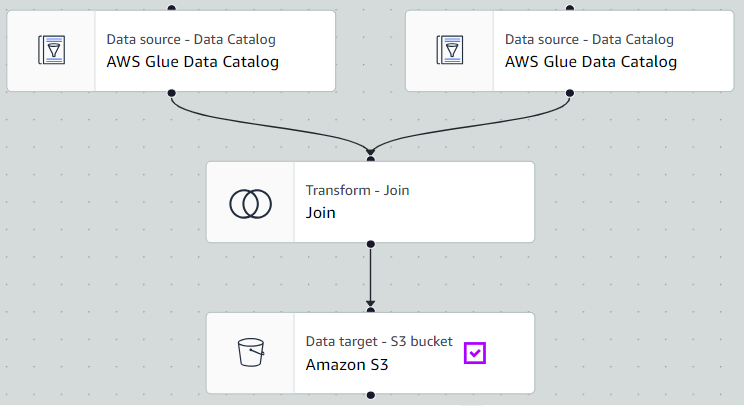
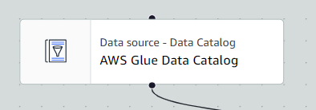
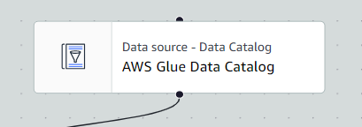
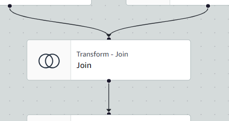
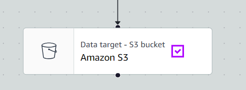

# Visual ETL Data Transformation (Silver Layer)

## 📌 Overview
This job extracts two bronze-level tables (`nihdars_data_request_bronze` and `nmrr_general_information_bronze`) from the AWS Glue Data Catalogue, joins them, validates data quality, and saves the resulting dataset as a modern Iceberg table in the Silver layer.

Things to consider:
- Ingestion to the silver layer usually involves joining multiple tables, enriching data, and standardising the schema.
- Data quality checks are enforced before writing to the target to ensure basic structural integrity (e.g., verifying columns exist).

## 🖼️ Visual Pipeline
*(Below is the conceptual layout of the AWS Glue Visual Canvas for this job)*

## ⚙️ Step-by-Step Technical Details

### 1. Set the name of the Visual ETL
Ensure the job is named correctly to reflect its role in the `bronze-to-silver` pipeline.

### 2. Set the job details (minimal things to do)
 - **IAM Role:** select 'AWSGlueServiceRole'
 - **Glue Version:** Default selection
 - **Language:** Default Selection ('Python 3')
 - **Worker type:** choose minimal 'G 2x' (the higher the type, processing will be fast, but it will incur more cost!!)
 - **Requested number of workers:** set it to minimal '2' or more (the more the worker, the higher the cost charge!!)

### 3. Add node (click on the blue '+' button at top right of the canvas)

### 3a. Data Source 1 - select 'Source' > 'AWS Glue Data Catalogue'

* **Name Nodes/source:** `nihdars_data_request_bronze`
* **Database:** `prism_bronze`
* **Table Name:** `nihdars_data_request_bronze`

### 3b. Data Source 2 - select 'Source' > 'AWS Glue Data Catalog'

* **Name Nodes/source:** `nmrr_general_information_bronze`
* **Database:** `prism_bronze`
* **Table Name:** `nmrr_general_information_bronze`

### 3c. Transform: Join - select 'Transform' > 'Join'

Combine the two raw tables into a single consolidated view.
* **Node Parents:** `nihdars_data_request_bronze` and `nmrr_general_information_bronze`
* **Join Type:** Left Join
* **Join Conditions:** `nmrr_number` (from the first table) == `nmrr_id` (from the second table)
* **Please note that the join condition should have reference column that present in both tables (Primary keys / Foreign keys).**

### 3d. Transform: Evaluate Data Quality - select 'Transform' > 'Evaluate Data Quality' (this will be set automatic following the creation of target folder )
Check the joined data to ensure it meets minimum structural requirements before saving.
* **Node Parents:** Transform Node 'Join'
* **Ruleset:** `ColumnCount > 0`
* **Publishing Options:** Data Quality Results Publishing is enabled with a `BEST_EFFORT` strategy.

### 3e. Data Target (Silver Layer) - select 'Target' > 'Amazon S3'

The joined and validated data is saved to the Silver layer inside the Glue Data Catalogue.
* **Node Parents:** Transform Node 'Evaluate Data Quality'
* **Database:** `prism_silver`
* **Table Name:** `research_general_info_data_request_silver_join`
* **Target Location:** `s3://prism-nih-silver/prism_silver/liana_test_join`
* **Format:** Apache Iceberg (Format version 2)
* **Compression:** Snappy
* **Save Logic:** The script queries the catalogue to see if `research_general_info_data_request_silver_join` exists in the `prism_silver` database. If it is a new table, it creates it. If it already exists, it dynamically appends the new rows. 

### 4. Save the visual ETL file , then click "RUN"
- progress of the job run can be monitored in the 'Job Run Monitoring' menu on the left

### SQL syntax function *replace '<.....>' with relevant information, do not delete other symbol shown in the syntax
1) Standardise Row Value
- SELECT *, regexp_replace(<row_input>, '<new_row_input>', '') AS <rename_header_column_name> FROM  <"database/schema_location">.<"table_name">
* e.g. <row_input> = NMRR_ID to <new_row_input> = 'ID'
* <rename_header_column_name> = e.g. nmrr_id_cleaned

**regexp_replace will create a new column with the newly edited row**

2) Joining Tables (FULL JOIN, LEFT JOIN,OUTER JOIN)
- WITH step1 AS (
 SELECT t1.*, regexp_replace([row_input],'[new_row_input]', '') AS [rename_header_column_name] FROM  "[database/schema_location]"."[first_able_name]" t1
)
SELECT step1.*, t2.site_1 FROM step1 
FULL JOIN "[database/schema_location]"."[second_table_name]" t2
ON t2.[header_column_name] = step1.[rename_header_column_name]

**Please note that the join condition should have reference column that present in both tables (Primary keys / Foreign keys).**

**INNER JOIN** is the strictest type of join. It returns only the records that have matching values in both tables.
**OUTER JOIN** is the opposite of an Inner Join because it does not require a match in both tables to keep a row.Outer joins keep the matched rows, but they also keep the unmatched rows from one or both tables, filling in the missing data with NULL (blanks).

There are three specific types of Outer Joins:
- LEFT OUTER JOIN: Keeps everything from the left table. 
- RIGHT OUTER JOIN: Keeps everything from the right table.
- FULL OUTER JOIN: Keeps everything from both tables.

**FULL JOIN** is simply the shorthand name for a FULL OUTER JOIN
**LEFT JOIN** also known as a LEFT OUTER JOIN