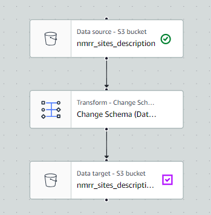
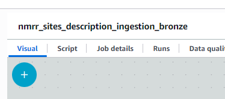
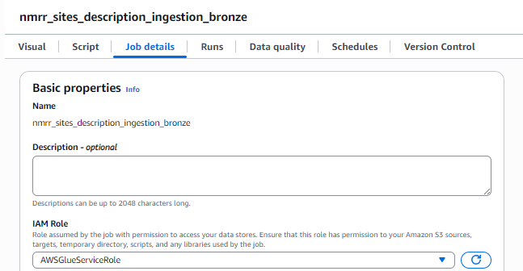
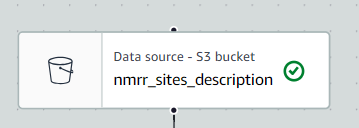
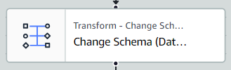
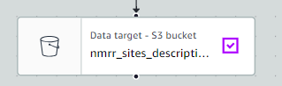
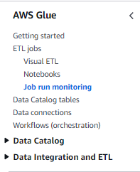

# Visual ETL Data Ingestion: NMRR Sites Description (Bronze Layer)

## 📌 Overview
This job takes the raw `nmrr_sites_description.csv` file from our landing S3 bucket, cleans up the data types, checks for empty files, and saves it as a modern Iceberg table in the Bronze layer.

Things to consider
- ingestion to bronze shall require 1-1 copy of the exact data (minimise the changes to the dataset)
- usually at this stage will usually involve clean headers & change Schema

## 🖼️ Visual Pipeline
*(Below is the screenshot of the AWS Glue Visual Canvas)*

## ⚙️ Step-by-Step Technical Details

### 1. Set the name of the Visual ETL

### 2. Set the job details (minimal things to do)

 - IAM Role : select 'AWSGlueServiceRole'
 - Glue Version : Default selection
 - Language : Default Selection ('Phyton 3')
 - Worker type : choose minimal 'G 2x' (the higher the type , processing will be fast but it will incur more cost!!)
 - Requested number of workers : set it to minimal '2'or more (the more the worker , the higher the cost charge!!)

### 3. Add node (click on the blue '+' button at top right of the canvas)

### 3a. Data Source (S3) - select 'Source' > 'Amazon S3'

* **Name Nodes/source:** 'nmrr_site_description'
* **Type:** Amazon S3 (CSV format , delimiter ',')
* **Path:** Select the path of the s3 source file `s3://<your-landing-bucket-name>/synthetic_data/nmrr_sites_description.csv`
* **Settings:** First line of source file contains column headers
* Preview the data table over the 'Data Preview' section. Data Schema can be viewed over the 'Output schema' section located next to the 'Data Preview'

### 3b. Transform: Change Schema (if needed) - select 'Transform' > 'Change Schema'

Change the raw text into specific data types so the database can read them properly. (for the complicated data type , e.g date - do it in the bronze to silver stage !)
* **Node Parents:** Source Node 'nmrr_site_description'
* **Changed to e.g. Varchar:** `unique_hash`, `research_id`, `nmrr_id`
* **Kept the rest as String:** `name_of_principal_investigator`, `pi_affiliation`, and all `site_1` through `site_13` columns.

### 3c. Data Target (Bronze Layer) - select 'Target' > 'Amazon S3'

The cleaned data is saved to our Glue Data Catalog.
* **Node Parents:** Transform Node 'Change Scheme (Data Type)'
* **Database:** Select the bucket `prism_bronze`
* **Table Name:** Set the table name as `nmrr_sites_description_bronze`
* **Format:** Select Apache Iceberg (Format version 2)
* **Compression:** Snappy
* **Partition Key:** Add partition ,e.g.  year (2025), month, etc
* **Save Logic:** The script automatically checks if the table exists. If it is new, it creates it. If it already exists, it simply appends (adds) the new rows. Preview the table over the 'Data Preview' section. Data Schema can be viewed at the 'Output schema' 

### 4. Save the visual ETL file , then click "RUN"
- progress of the job run can be monitored in the 'Job Run Monitoring' menu on the left 
- successful job indicate that the ingestion and creation of data catalogue with a table has been successfully created in the target S3 bucket

### SQL syntax function *replace '<.....>' with relevant information, do not delete other symbol shown in the syntax
1) Preview Schema 
- DESCRIBE <table_name>; -- for file that is not in Iceberg Apache format e.g. CSV,JSON, etc2
- DESCRIBE FORMATTED <table_name>; --for file in Iceberg Apache format

2) Change Data Type
- SELECT *, CAST(<header_date_column_name> AS DATE) AS <new_header_date_column_name> FROM <"database/schema_location">.<"table_name">  limit 10; -- to change data type related to date 

* CAST will create a new column with the newly assigned data type 
